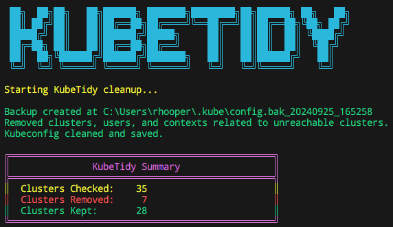

<p align="center">
  
</p>
<h1 align="center" style="font-size: 100px;">
  <b>KubeTidy</b>
</h1>

</br>


[](https://github.com/PixelRobots/KubeTidy/actions/workflows/publish-krewplugin.yaml)


---


**KubeTidy** is a PowerShell tool designed to clean up your Kubernetes configuration file by removing unreachable clusters, along with associated users and contexts. It simplifies the management of your `kubeconfig` by ensuring that only reachable and valid clusters remain, making it easier to work with multiple Kubernetes environments. **KubeTidy** also supports merging multiple `kubeconfig` files into one.

## Features

- **Cluster Reachability Check:** Checks clusters to ensure they are reachable and removes those that are not.
- **Exclusion List:** Allows you to specify clusters to skip from removal (useful for VPN-bound or temporarily unreachable clusters).
- **User and Context Cleanup:** Automatically removes users and contexts associated with removed clusters.
- **Backup Creation:** Automatically creates a backup of the original kubeconfig before performing any cleanup.
- **Summary Report:** Provides a neat summary of how many clusters were checked, removed, and retained.
- **Force Cleanup Option:** If all clusters are unreachable, KubeTidy can force a cleanup using the `-Force` parameter.
- **List Clusters Option**: Use the `-ListClusters` parameter to list all clusters in your kubeconfig without performing any cleanup, with a count of total clusters displayed.
- **Merge Kubeconfig Files**: Easily merge multiple `kubeconfig` files into a single config file using the `-MergeConfigs` parameter.
- **List Contexts Option**: Use the `-ListContexts` parameter to list all available contexts in your kubeconfig file without making any changes.
- **Export Contexts Option**: Use the `-ExportContexts` parameter to export specific contexts from the kubeconfig. You can specify the output path using the `-DestinationConfig` parameter.
- **Preserve Current Context**: The current context is preserved in the cleaned kubeconfig unless it is associated with a removed cluster.
- **Dry Run Mode**: Use the `-DryRun` parameter to simulate cleanup or merging without actually making any changes to your kubeconfig files.
- **Verbose Output**: Provides detailed logging about cluster reachability and other operations using the `-Verbose` flag.

## Requirements

- PowerShell 7 or higher.
- [powershell-yaml](https://www.powershellgallery.com/packages/powershell-yaml) module for YAML parsing.

## Installation via PowerShell Gallery

You can install **KubeTidy** directly from the PowerShell Gallery:

```powershell
Install-Module -Name KubeTidy -Repository PSGallery -Scope CurrentUser
```

To update the module later:

```powershell
Update-Module -Name KubeTidy
```
Ensure you have the required dependencies installed by running the tool. It will automatically install the `powershell-yaml` module if not already installed.

## Installation via Krew (Linux and macOS only)

To install **KubeTidy** as a `kubectl` plugin using [Krew](https://krew.sigs.k8s.io/), follow the steps below:

1. **Install Krew**

   If you don't have Krew installed, you can install it by following the instructions [here](https://krew.sigs.k8s.io/docs/user-guide/setup/install/).

2. **Install KubeTidy Plugin**

   Once Krew is installed, use the following commands to install **KubeTidy** via Krew:

   ```bash
   curl -H "Cache-Control: no-cache" -O https://raw.githubusercontent.com/PixelRobots/KubeTidy/main/KubeTidy.yaml

   kubectl krew install --manifest="./KubeTidy.yaml"
   ```

3. **Run KubeTidy via Krew**

   After installation, you can run **KubeTidy** as a `kubectl` plugin:

   ```bash
   kubectl kubetidy -kubeconfig "$HOME/.kube/config" -exclusionlist "cluster1,cluster2"
   ```

4. **Upgrade KubeTidy via Krew**

   To update **KubeTidy** to the latest version via Krew, use the following command:

   ```bash
   kubectl krew upgrade kubetidy
   ```

### Platform Support

Please note that **KubeTidy** installed via Krew is supported only on Linux and macOS. It does not support Windows at this time.

## Usage

Once installed, run **KubeTidy** to clean your kubeconfig:

### PowerShell Gallery Usage

```powershell
Invoke-KubeTidy -KubeConfigPath "$HOME\.kube\config" -ExclusionList "cluster1,cluster2,cluster3"
```

### Krew Usage

You can use the same parameters as described in the [Parameters](#Parameters) section, but remember to prefix the command with `kubectl kubetidy`. For example:

- To simulate cleanup without making changes:
  ```bash
  kubectl kubetidy -kubeconfig "$HOME/.kube/config" -exclusionlist "cluster1,cluster2" -dryrun
  ```

- To list all clusters:
  ```bash
  kubectl kubetidy -kubeconfig "$HOME/.kube/config" -listclusters
  ```

## Parameters

- **`-KubeConfigPath`**: Path to your `kubeconfig` file. Defaults to `"$HOME\.kube\config"` if not specified.
- **`-ExclusionList`**: A comma-separated list of clusters to exclude from removal. (Useful for clusters requiring VPN or temporary networks.)
- **`-Backup`**: Set to `false` if you don't want a backup to be created. Defaults to `true`.
- **`-Force`**: Forces cleanup even if no clusters are reachable. Use this when you want to proceed with cleanup despite network issues.
- **`-ListClusters`**: Lists all clusters in the kubeconfig file without performing any cleanup, and displays the total number of clusters.
- **`-ListContexts`**: Lists all contexts in the kubeconfig file without performing any cleanup.
- **`-ExportContexts`**: Exports specific contexts from the kubeconfig. You can provide a comma-separated list of contexts to export.
- **`-MergeConfigs`**: Merges multiple `kubeconfig` files into one. Takes an array of file paths as input.
- **`-DestinationConfig`**: Path to save the merged or filtered `kubeconfig` file. If not specified, the default `"$HOME\.kube\config"` will be used.
- **`-DryRun`**: Simulates the cleanup or merging process without making any changes. Shows what would happen without modifying the `kubeconfig` file.
- **`-Verbose`**: Enables detailed logging during the cleanup process, including information about cluster reachability, backup creation, and module imports.

## Examples

### Cleaning up your kubeconfig

To exclude specific clusters from removal and clean up your kubeconfig:

```powershell
Invoke-KubeTidy -KubeConfigPath "$HOME\.kube\config" -ExclusionList "aks-prod-cluster,aks-staging-cluster"
```


If no clusters are reachable and you still want to proceed:

```powershell
Invoke-KubeTidy -KubeConfigPath "$HOME\.kube\config" -ExclusionList "aks-prod-cluster,aks-staging-cluster" -Force
```

### Simulating Cleanup with Dry Run

To simulate the cleanup process without making any actual changes:

```powershell
Invoke-KubeTidy -KubeConfigPath "$HOME\.kube\config" -ExclusionList "aks-prod-cluster,aks-staging-cluster" -DryRun
```

This will display the summary of the cleanup that **would** be performed but does not modify the actual `kubeconfig`.

### Merging multiple `kubeconfig` files

To merge multiple `kubeconfig` files into a single config file:

```powershell
Invoke-KubeTidy -MergeConfigs "config1.yaml","config2.yaml","config3.yaml" -DestinationConfig "$HOME\.kube\config"
```

This will merge the `config1.yaml`, `config2.yaml`, and `config3.yaml` into the destination config file (`$HOME\.kube\config` by default).

### Simulating Merge with Dry Run

To simulate the merging process without modifying the destination file:

```powershell
Invoke-KubeTidy -MergeConfigs "config1.yaml","config2.yaml","config3.yaml" -DestinationConfig "$HOME\.kube\config" -DryRun
```

This will show how the `kubeconfig` files would be merged without updating the destination file.

### Listing clusters

To list all clusters without performing any cleanup, along with the count of clusters:

```powershell
Invoke-KubeTidy -KubeConfigPath "$HOME\.kube\config" -ListClusters
```

### Listing contexts

To list all contexts without performing any cleanup:

```powershell
Invoke-KubeTidy -KubeConfigPath "$HOME\.kube\config" -ListContexts
```

### Exporting specific contexts

To export specific contexts from the kubeconfig:

```powershell
Invoke-KubeTidy -KubeConfigPath "$HOME\.kube\config" -ExportContexts "context1,context2" -DestinationConfig "$HOME\.kube\filtered-config"
```

### Verbose logging for detailed output

For detailed logging during the execution:

```powershell
Invoke-KubeTidy -KubeConfigPath "$HOME\.kube\config" -ExclusionList "aks-prod-cluster,aks-staging-cluster" -Verbose
```

#### Verbose Output Example

When using the `-Verbose` flag, you will receive detailed information like:

```
VERBOSE: No KubeConfig path provided. Using default: C:\Users\username\.kube\config
VERBOSE: powershell-yaml module loaded successfully.
VERBOSE: Creating a backup of the KubeConfig file.
VERBOSE: Checking reachability for cluster: aks-prod-cluster at https://example-cluster-url
VERBOSE: Cluster aks-prod-cluster is reachable via HTTPS.
VERBOSE: Removed the following clusters: aks-old-cluster
```

#### List Clusters Output Example

When using the `-ListClusters` parameter, you will receive output like this:

```
Listing all clusters in KubeConfig file:

Cluster: cluster1
Cluster: cluster2
Cluster: cluster3

Total Clusters: 3
```


#### List Contexts Output Example

When using the `-ListContexts` parameter, you will receive output like this:

```
Listing all contexts in KubeConfig file:

Context: context1
Context: context2
Context: context3

Total Contexts: 3
```

#### Output Example

After execution, you will receive a summary like the following:

```
╔════════════════════════════════════════════════╗
║               KubeTidy Summary                 ║
╠════════════════════════════════════════════════╣
║  Clusters Checked:    26                       ║
║  Clusters Removed:     2                       ║
║  Clusters Kept:       24                       ║
╚════════════════════════════════════════════════╝
```

## Changelog

All notable changes to this project are documented in the [CHANGELOG](./CHANGELOG.md).

## License

This project is licensed under the MIT License. See the [LICENSE](./LICENSE) file for more details.